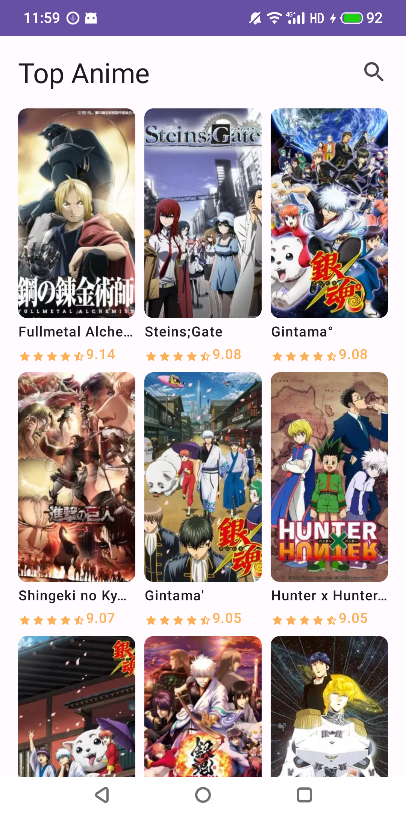
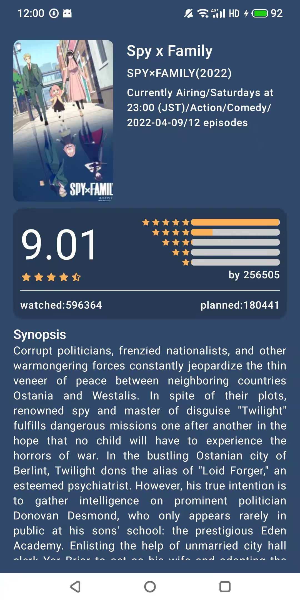

# Anime

Anime is App display top anime list, anime search and anime detail data
from [Jikan Api](https://docs.api.jikan.moe/)

# Android development

Anime is an app that attempts to use the latest libraries and tools. As a summary:

- Entirely written in Kotlin.
- UI completely written in Jetpack Compose (see below).
- Uses Kotlin Coroutines throughout.
- Uses many of the Architecture Components, including: Room, Navigation, Paging3.
- Uses Hilt for dependency injection

# Code style

Anime uses ktlint, provided via the spotless gradle plugin, and the bundled project IntelliJ
codestyle.

# Compose

